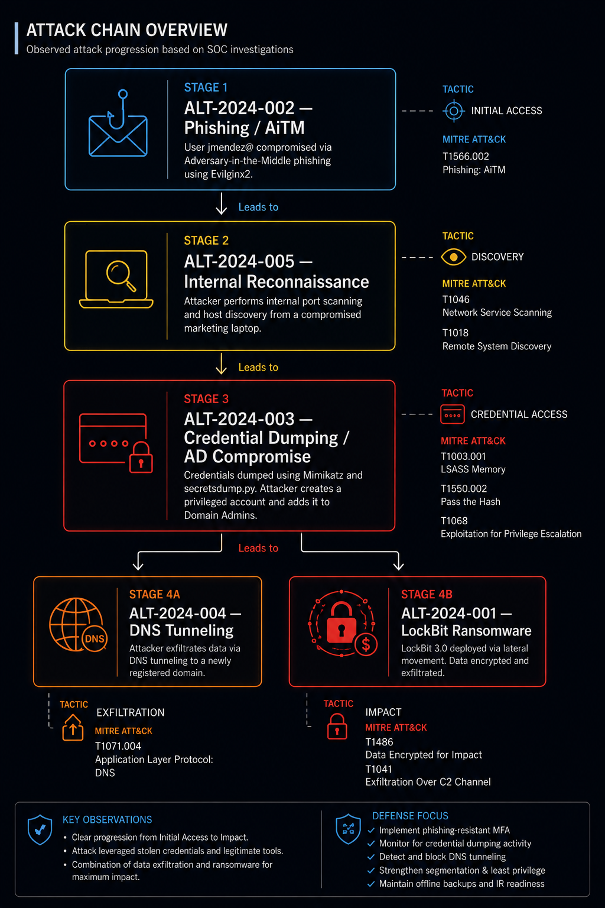

# 08 — Incident Response
## Liberty Co. Security Engagement | SOC Investigation Log

---

## Overview

Following the infrastructure hardening phase (Sprint 1), Liberty Co.'s SIEM and perimeter security controls began generating alerts consistent with active threat actor presence across multiple segments of the environment.

A total of **five alerts** were investigated between June 22–23, 2024, following formal Incident Response procedures aligned with **NIST SP 800-61 Rev. 2**. Each alert was triaged, analyzed for false positive probability, correlated against adjacent activity, and mapped to the **MITRE ATT&CK Enterprise Matrix**.

Evidence collected across all five investigations suggests these alerts are not isolated events — they represent distinct phases of a **single coordinated intrusion** that progressed from initial access through privilege escalation, lateral movement, and data exfiltration.

---

## Alert Index

| Alert ID | Type | Source | Severity | Status |
|---|---|---|---|---|
| [ALT-2024-001](./ALT-2024-001-ransomware-lockbit.md) | Ransomware — LockBit 3.0 | CrowdStrike EDR | Critical | Contained |
| [ALT-2024-002](./ALT-2024-002-phishing-credential-theft.md) | Phishing / AiTM / Credential Theft | Microsoft Defender / Azure AD | High | Contained |
| [ALT-2024-003](./ALT-2024-003-credential-dumping-privesc.md) | Credential Dumping / Privilege Escalation | SIEM / Wazuh + Windows Event Logs | Critical | Contained |
| [ALT-2024-004](./ALT-2024-004-dns-tunneling-exfiltration.md) | DNS Tunneling / Data Exfiltration | Palo Alto NGFW | High | Contained |
| [ALT-2024-005](./ALT-2024-005-internal-network-scanning.md) | Internal Network Scanning / Reconnaissance | IDS / Suricata | Medium | Contained |



## Reconstructed Attack Chain

Based on evidence collected across all five investigations, the following attack sequence is assessed as the most probable chronological order of events. Causal links marked as **confirmed** are supported by direct evidence. Links marked as **assessed** represent the most probable interpretation of available evidence pending full timeline correlation.

```
[INITIAL ACCESS]
ALT-2024-002 — Phishing / AiTM
Attacker delivers phishing email to jmendez@libertyCo.com
evilginx2 intercepts session token → MFA bypassed
HR storage accessed → RRHH/Nomina_2024.xlsx exfiltrated (4.2 MB)
Status: Confirmed

        │
        ▼ (assessed)

[RECONNAISSANCE]
ALT-2024-005 — Internal Network Scanning
LAPTOP-MKT-03 used to scan 192.168.0.0/16
1,247 hosts enumerated across ports 22/80/443/445/1433/3306/3389
Production DB (10.0.0.45) and RDP targets identified
Status: Assessed — timeline correlation pending

        │
        ▼ (assessed)

[PRIVILEGE ESCALATION]
ALT-2024-003 — Credential Dumping / AD Compromise
m1m1k4tz.exe + Impacket secretsdump.py executed on Carlos Ruiz endpoint
LSASS dump performed → credential hashes extracted
svc_backup_adm created → added to Domain Admins
Full domain control obtained
Status: Confirmed

        │
        ├──────────────────────────────────┐
        ▼ (assessed)                       ▼ (assessed)

[EXFILTRATION]                      [IMPACT]
ALT-2024-004 — DNS Tunneling        ALT-2024-001 — LockBit 3.0
svc_database instrumented           svchost32.exe (PID 4492) deployed
14,200 DNS queries / 45 min         C2 beacon → lockbit3-decryptor.onion
Base64-encoded subdomains           847 files encrypted
Data exfiltrated via DNS tunnel     Accounting segment disrupted
Status: Assessed                    Status: Confirmed
```

---

## Composite MITRE ATT&CK Coverage

| Tactic | Techniques Observed |
|---|---|
| **Initial Access** | T1566.002 — Spearphishing Link |
| **Credential Access** | T1557 — AiTM · T1539 — Session Cookie Theft · T1003.001 — LSASS Dump · T1003.002 — SAM Credential Dumping |
| **Discovery** | T1046 — Network Service Scanning · T1018 — Remote System Discovery |
| **Privilege Escalation** | T1548 — Abuse Elevation Control · T1098.003 — Add to Group |
| **Persistence** | T1136.002 — Create Domain Account · T1078 — Valid Accounts |
| **Defense Evasion** | T1036.005 — Process Masquerading · T1564.006 — Run Virtual Instance |
| **Lateral Movement** | T1021 — Remote Services |
| **Exfiltration** | T1048.001 — Exfiltration via DNS · T1041 — Exfiltration Over C2 |
| **Impact** | T1486 — Data Encrypted for Impact |

---

## Key Findings

- **The environment was compromised across at least four distinct segments:** user endpoints, Active Directory, the production database server, and the accounting file server.
- **A single phishing email was the probable initial access vector** — the entire intrusion chain traces back to the AiTM attack against `jmendez@`.
- **Domain Admin access was the force multiplier** — once `svc_backup_adm` was elevated to Domain Admins, the threat actor had unrestricted reach across the environment.
- **Detection occurred after impact** — LockBit deployment and DNS exfiltration were already underway when the first alerts fired, indicating a need for earlier detection controls at the endpoint and identity layers.
- **Network segmentation (Sprint 1) limited blast radius** — VLAN segmentation prevented the ransomware from spreading beyond the accounting segment.

---

## Investigation Status

| Area | Status |
|---|---|
| Full attack timeline reconstruction | In progress |
| Total data exfiltrated (volume + content) | Under investigation |
| Initial access vector confirmed | Assessed — pending log correlation |
| Attacker infrastructure attribution | Pending threat intelligence review |
| All affected accounts identified | In progress |
| Forensic acquisition complete | Partial — LAPTOP-MKT-03 and accounting server pending |

---

*All findings reflect the state of the investigation as of the initial triage phase. Reports will be updated as forensic analysis and log correlation progress.*
