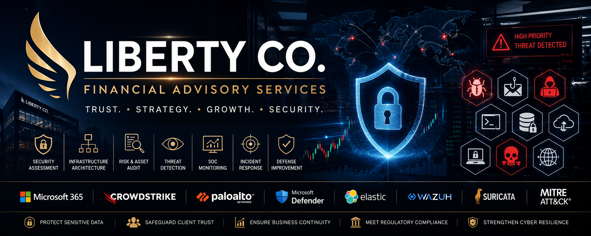

# Liberty Co. — Enterprise Security Assessment & Incident Response

## Overview

This repository documents a full-cycle cybersecurity engagement performed for **Liberty Co.**, a fictional financial advisory firm providing wealth management, investment consulting, and portfolio administration services to individual and small-business clients.

The engagement is structured in two phases that reflect the natural lifecycle of a professional security consulting project:

1. **Security Assessment & Infrastructure Hardening** — inventory of critical assets, network architecture review, and implementation of foundational controls: network segmentation, DMZ, firewall policy, credential hardening, and centralized logging via SIEM.
2. **SOC Monitoring & Incident Response** — investigation of security alerts generated after the hardening phase, following a formal IR process aligned with **NIST SP 800-61** and mapped against the **MITRE ATT&CK Enterprise Matrix**.

All findings, conclusions, and recommendations in this repository are derived from evidence documented within each report. Where evidence is insufficient to support a definitive conclusion, findings are explicitly flagged as hypotheses or open investigative leads — never presented as confirmed fact.

---

## Client Profile

| Field | Detail |
|---|---|
| **Organization** | Liberty Co. |
| **Industry** | Financial Advisory Services |
| **Size** | 35–50 employees |
| **Operating hours** | Monday–Friday, 05:00–17:00 (aligned to market hours) |
| **Remote access** | Corporate VPN |
| **Critical assets** | Client database, trading history, wealth management records, regulatory documentation, contracts, tax records, financial statements, Active Directory, Microsoft 365, SQL Server, file server, backup system, SIEM |
| **Data classification** | Public / Internal / Confidential / **Restricted** |

> All client financial data, trading records, and regulatory documentation are classified as **Restricted**.

---

## Repository Structure

```
liberty-co-security-engagement/
│
├── 01-company-profile/          # Business context, asset inventory, data classification
├── 02-initial-infrastructure/   # Pre-engagement architecture and identified gaps
├── 03-asset-audit/              # Asset and file audit findings
├── 04-infrastructure-redesign/  # Segmentation strategy, DMZ placement, control rationale
├── 05-network-architecture/     # Before / After network diagrams
├── 06-security-controls/        # Firewall policy, VLANs, credential hardening, SIEM deployment
├── 07-soc-monitoring/           # Alert triage log and monitoring workflow
├── 08-incident-response/        # Full investigation reports per alert
├── 09-mitre-attack-mapping/     # ATT&CK technique mapping per incident
└── 10-recommendations-roadmap/  # Final recommendations, remediation roadmap, lessons learned
```

---

## Methodology

| Area | Reference |
|---|---|
| Incident Handling | NIST SP 800-61 Rev. 2 |
| Threat Mapping | MITRE ATT&CK Enterprise Matrix |
| Investigative standard | Evidence-based — every conclusion tied to a specific artifact, log source, or alert |
| Gap handling | Evidence gaps are explicitly flagged rather than filled with assumption |

---

## Incidents Investigated

| Alert ID | Type | Source | Status |
|---|---|---|---|
| ALT-2024-001 | Ransomware (LockBit) | CrowdStrike EDR | Investigated |
| ALT-2024-002 | Phishing / Credential Theft | Microsoft Defender / Azure AD | Investigated |
| ALT-2024-003 | Credential Dumping / Privilege Escalation | SIEM / Windows Event Logs | Investigated |
| ALT-2024-004 | Anomalous Database Activity / Potential Exfiltration | Palo Alto NGFW | Investigated |
| ALT-2024-005 | Internal Network Scanning | IDS / Suricata | Investigated |

---

## Author

Documentation authored and maintained as part of an ongoing Blue Team / DFIR portfolio project.

> **Disclosure:** Liberty Co. is a fictional organization created for portfolio and professional development purposes. No real client data, systems, or individuals are represented in this repository.
